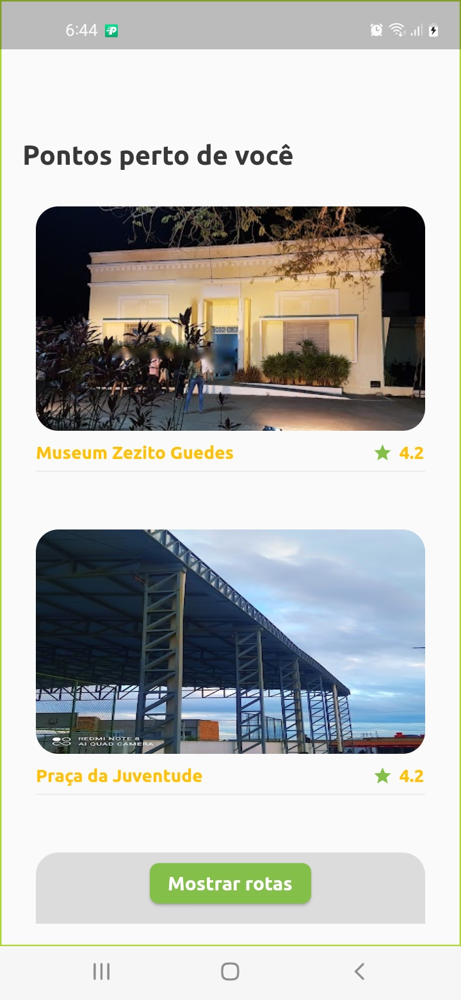
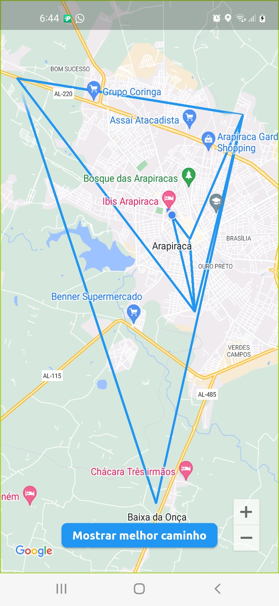
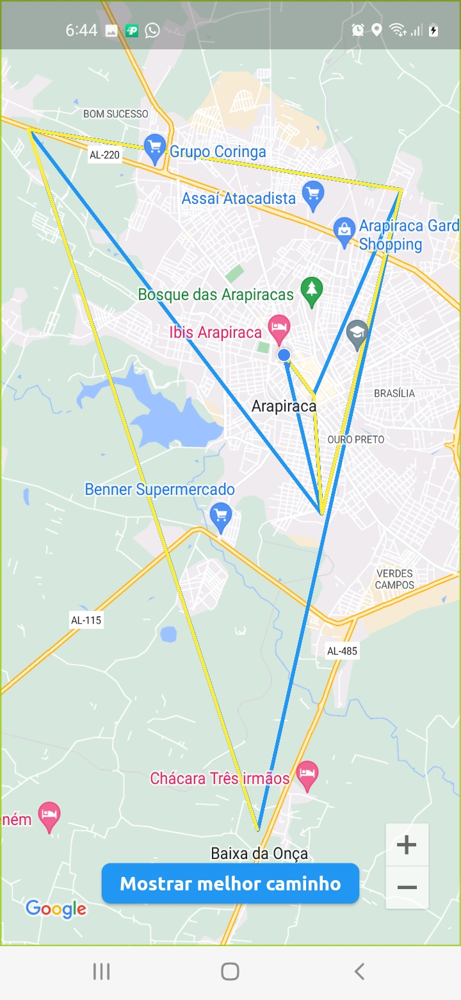
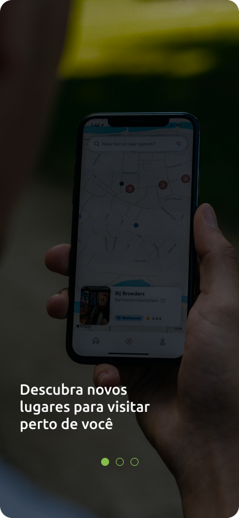
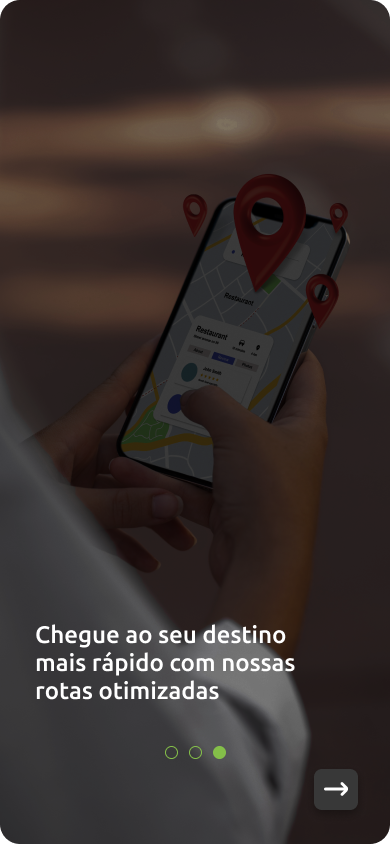
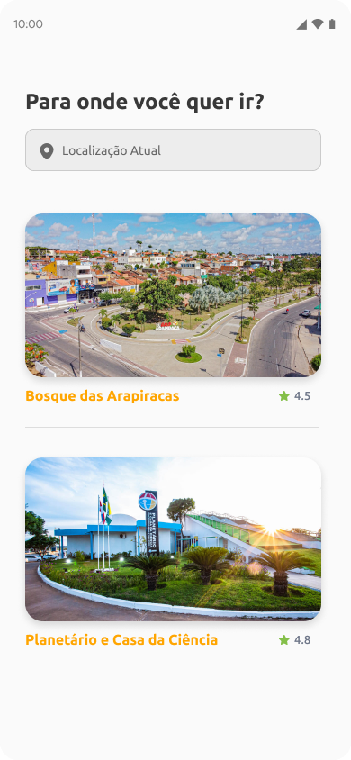
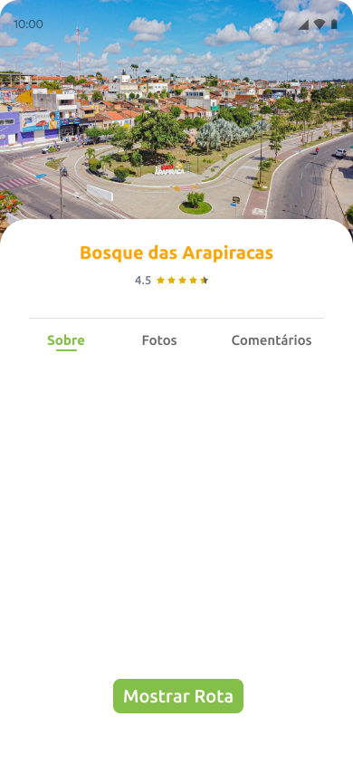

# VisiteLá

VisiteLá é um aplicativo móvel projetado para ajudar os turistas a explorar e descobrir pontos turísticos em um determinado mapa. Utilizando o algoritmo de Dijkstra, o aplicativo determina o melhor caminho para visitar todos os pontos turísticos, proporcionando uma experiência de viagem eficiente e agradável.

## Funcionalidades

- 🔍 **Explorar pontos turísticos:** O VisiteLá permite que os usuários explorem uma ampla variedade de pontos turísticos disponíveis em um mapa específico. Os usuários podem obter informações detalhadas sobre cada local, como descrições, fotos e avaliações de outros usuários.

- 🗺️ **Algoritmo de Dijkstra:** O aplicativo utiliza o renomado algoritmo de Dijkstra para calcular o melhor caminho para visitar todos os pontos turísticos selecionados pelo usuário. Isso ajuda a otimizar o itinerário e economizar tempo, garantindo que os turistas possam aproveitar ao máximo sua experiência de viagem.

- 🚶 **Navegação orientada:** O VisiteLá oferece orientação passo a passo para os usuários, ajudando-os a navegar de um ponto turístico para outro de forma eficiente. O aplicativo fornece direções claras e precisas, facilitando a visita aos pontos turísticos.

## Screenshots

## Pacotes Principais

- `google_maps_flutter`: O VisiteLá integra o Google Maps para fornecer uma experiência de navegação aprimorada. Os usuários podem visualizar os pontos turísticos no mapa, ver sua localização atual e planejar suas rotas interativamente. A integração com o Google Maps também permite que os usuários obtenham informações em tempo real sobre o tráfego e outras condições relevantes para sua jornada.
- `location`: O pacote "location" do Flutter é uma biblioteca que permite obter informações de localização em tempo real, como latitude, longitude e altitude, no desenvolvimento de aplicativos móveis.
- `retrofit`: O VisiteLá utiliza o retrofit como cliente HTTP para simplificar o consumo de APIs REST, facilitando a definição e execução de chamadas de rede.
- `collection`: Pacote utilizado para dar suporte ao algoritmo de Dijkstra.

## Identidade Visual

## Licença

O VisiteLá está licenciado sob a [Licença MIT](https://opensource.org/licenses/MIT). Sinta-se à vontade para utilizar, modificar e distribuir este projeto de acordo com os termos da licença.

